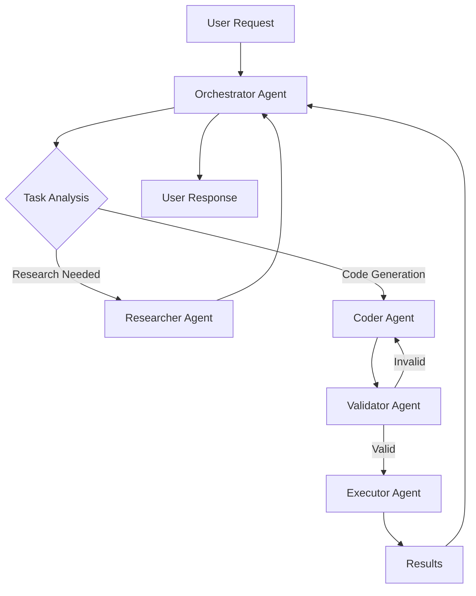

# Claude Code Agent System

## Overview

The Claude Code Agent System is an advanced multi-agent orchestration framework built on top of the Claude Code SDK. It provides a sophisticated system for managing complex AI workflows with specialized agents working together to accomplish tasks.

## Architecture

### Core Components

1. **Base Agent Framework** (`base_agent.py`)
   - Abstract base class for all agents
   - Message queue based communication
   - State management and persistence

2. **Specialized Agents**
   - **Orchestrator Agent**: Manages task distribution and coordination
   - **Researcher Agent**: Performs web searches and information gathering
   - **Coder Agent**: Generates and modifies code
   - **Validator Agent**: Tests and validates solutions
   - **Executor Agent**: Runs code and manages execution environments

3. **Tool Registry Integration**
   - Full integration with evalscompany tool registry (port 2016)
   - Dynamic tool creation and management
   - Meta-registration capabilities

4. **Task Management System**
   - Priority-based task scheduling
   - Progress tracking and monitoring
   - Result aggregation and reporting

## Installation

This agent system will be available as a separate package:

```bash
pip install claude-code-agent-system
```

Or install directly from this directory during development:

```bash
pip install -e agent_system/
```

## Dependencies

The agent system requires:
- `claude-code-sdk>=0.0.10`
- `fastapi>=0.104.0`
- `uvicorn>=0.24.0`
- `neo4j>=5.0.0` (optional, for state persistence)
- `redis>=5.0.0` (optional, for message queuing)
- `httpx>=0.25.0`

## Quick Start

### 1. Start the Agent System Server

```python
from claude_code_agent_system import AgentSystem

# Initialize the agent system
agent_system = AgentSystem()

# Start the server
agent_system.run(host="0.0.0.0", port=8888)
```

### 2. Submit a Task

```python
import httpx

# Submit a complex task
response = httpx.post("http://localhost:8888/task", json={
    "description": "Create a web scraper for news articles",
    "requirements": [
        "Extract title, author, date, and content",
        "Handle pagination",
        "Save to JSON format",
        "Include error handling"
    ],
    "priority": "high"
})

task_id = response.json()["task_id"]
```

### 3. Monitor Progress

```python
# Get task status
status = httpx.get(f"http://localhost:8888/task/{task_id}")
print(status.json())
```

## Agent Communication Flow



## Integration with Claude Code SDK

The agent system leverages the Claude Code SDK for all interactions with Claude:

```python
from claude_code_sdk import query, ClaudeCodeOptions
from claude_code_agent_system import BaseAgent

class CustomAgent(BaseAgent):
    async def process_with_claude(self, prompt: str):
        options = ClaudeCodeOptions(
            allowed_tools=["Read", "Write", "Edit", "Bash"],
            max_thinking_tokens=10000
        )
        
        async for message in query(prompt=prompt, options=options):
            # Process Claude's responses
            await self.handle_message(message)
```

## Configuration

Configure the agent system via environment variables:

```bash
# Core settings
AGENT_SYSTEM_PORT=8888
AGENT_SYSTEM_HOST=0.0.0.0

# Tool Registry
TOOL_REGISTRY_URL=http://localhost:2016

# Optional: Neo4j for persistence
NEO4J_URI=bolt://localhost:7687
NEO4J_USER=neo4j
NEO4J_PASSWORD=password

# Optional: Redis for queuing
REDIS_URL=redis://localhost:6379
```

## Advanced Features

### Custom Agent Development

Create your own specialized agents:

```python
from claude_code_agent_system import BaseAgent

class DataAnalysisAgent(BaseAgent):
    name = "DataAnalyst"
    
    async def analyze_data(self, data_path: str):
        # Custom data analysis logic
        pass
    
    async def generate_report(self, analysis_results):
        # Use Claude to generate insights
        pass
```

### Tool Creation and Management

Register custom tools with the system:

```python
from claude_code_agent_system import ToolRegistry

registry = ToolRegistry()

# Register a new tool
await registry.create_tool({
    "name": "WebScraper",
    "description": "Scrapes web pages",
    "parameters": {
        "url": {"type": "string", "required": True},
        "selector": {"type": "string", "required": False}
    },
    "implementation": "def scrape(url, selector=None): ..."
})
```

### Workflow Orchestration

Define complex multi-agent workflows:

```python
from claude_code_agent_system import Workflow

workflow = Workflow("DataPipelineWorkflow")

# Define workflow steps
workflow.add_step("fetch_data", agent="Researcher")
workflow.add_step("clean_data", agent="Coder", depends_on=["fetch_data"])
workflow.add_step("analyze_data", agent="DataAnalyst", depends_on=["clean_data"])
workflow.add_step("generate_report", agent="Coder", depends_on=["analyze_data"])

# Execute workflow
results = await workflow.execute(initial_data={...})
```

## API Reference

### REST Endpoints

- `POST /task` - Submit a new task
- `GET /task/{task_id}` - Get task status
- `GET /agents` - List available agents
- `POST /agent/{agent_name}/message` - Send message to specific agent
- `GET /tools` - List available tools
- `POST /tools` - Register a new tool

### WebSocket Endpoints

- `/ws` - Real-time task updates and agent communication

## Development

### Running Tests

```bash
# Install dev dependencies
pip install -e ".[dev]"

# Run tests
pytest tests/
```

### Contributing

1. Fork the repository
2. Create a feature branch
3. Make your changes
4. Add tests
5. Submit a pull request

## Roadmap

- [ ] Package as standalone `claude-code-agent-system`
- [ ] Add more specialized agents (DatabaseAgent, APIAgent, etc.)
- [ ] Implement distributed agent execution
- [ ] Add agent memory and learning capabilities
- [ ] Create web UI for agent system management
- [ ] Support for custom agent plugins

## License

Same as Claude Code SDK - see LICENSE file.